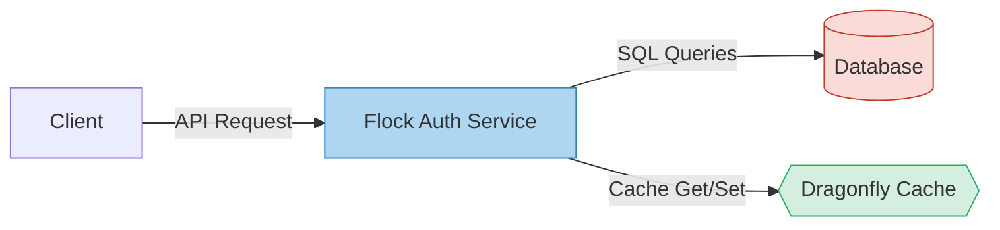

# Flock Auth Database

This directory contains the files necessary to deploy the Flock Auth databases.

More specifically, we will deploy these databases using Skaffold and Helm:

1. https://www.postgresql.org/
2. https://www.dragonflydb.io/

This will be done by following these examples:

1. https://github.com/wcygan/ping/blob/main/postgres/skaffold.yaml
2. https://github.com/wcygan/dragonfly-k8s/blob/main/skaffold.yaml

The databases will have the following names:

1. flock-auth-postgres
2. flock-auth-dragonfly

